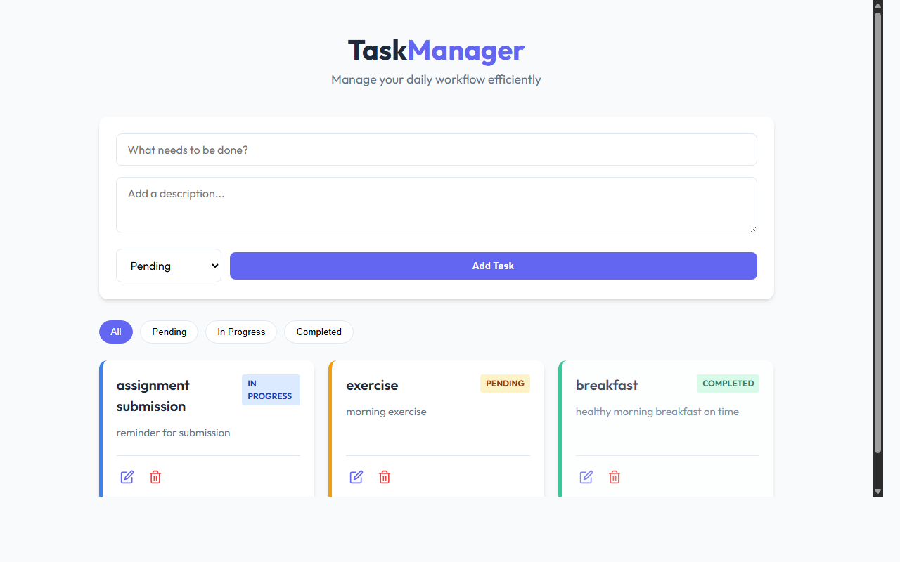

# TaskManager - Full Stack Task Management Application

A production-ready, full-stack Task Management Web Application built with Node.js, Express, MongoDB, and Vanilla JavaScript. This project demonstrates clean API architecture, responsive design, and full CRUD functionality.

## 🚀 Live Demo & Screenshots


*Real screenshot of the application dashboard featuring task creation, filtering, and management.*

## Features
- **Create Tasks**: Add new tasks with titles, descriptions, and statuses.
- **View Tasks**: List all tasks with a modern, responsive grid layout.
- **Update Tasks**: Edit task details or change statuses (Pending, In Progress, Completed).
- **Delete Tasks**: Remove tasks with a confirmation prompt.
- **Status Filters**: Filter tasks by their current status.
- **Modern UI**: Clean, professional design with smooth transitions and HSL color palettes.

## Tech Stack
- **Frontend**: HTML5, Vanilla CSS (Flexbox/Grid), Vanilla JavaScript.
- **Backend**: Node.js, Express.js.
- **Database**: MongoDB (via Mongoose ODM).
- **Middleware**: CORS, Dotenv, Express JSON Parser.

## Project Structure
```text
/backend
  /config         # Database configuration
  /controllers    # API logic
  /models         # Database schemas
  /routes         # API endpoint definitions
  server.js       # Main server entry point
/frontend
  index.html      # Main UI structure
  style.css       # Custom responsive styling
  app.js          # Logic & API interaction
  vercel.json     # Vercel deployment config
render.yaml       # Render.com deployment config
```

## Setup Instructions

### Prerequisites
- [Node.js](https://nodejs.org/) installed.
- [MongoDB](https://www.mongodb.com/) installed and running locally OR a MongoDB Atlas URI.

### 1. Backend Setup
1. Navigate to the `backend` folder:
   ```bash
   cd backend
   ```
2. Install dependencies:
   ```bash
   npm install
   ```
3. Configure environment variables in `.env`:
   ```text
   PORT=5000
   MONGO_URI=mongodb://localhost:27017/taskmanager
   NODE_ENV=development
   ```
4. Start the server:
   ```bash
   npm start
   ```

### 2. Frontend Setup
1. Simply open `frontend/index.html` in your web browser.
2. Ensure the backend server is running on `http://localhost:5000`.

## 🌐 Making it Live (Deployment)

### Backend (Render)
1. Push this code to GitHub.
2. Connect your repo to [Render.com](https://render.com).
3. Use the `render.yaml` file provided for automatic setup.
4. Add your `MONGO_URI` as an environment variable in Render.

### Frontend (Vercel)
1. Connect your repo to [Vercel](https://vercel.com).
2. Set the root directory to `frontend`.
3. Vercel will automatically use `vercel.json` to handle API routing.

## API Documentation

| Method | Endpoint | Description |
| --- | --- | --- |
| GET | `/api/tasks` | Get all tasks (supports query `?status=Pending`) |
| GET | `/api/tasks/:id` | Get a single task by ID |
| POST | `/api/tasks` | Create a new task |
| PUT | `/api/tasks/:id` | Update a task |
| DELETE| `/api/tasks/:id` | Delete a task |

## License
MIT
